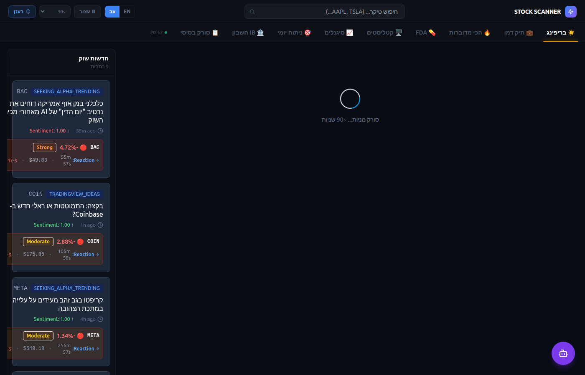
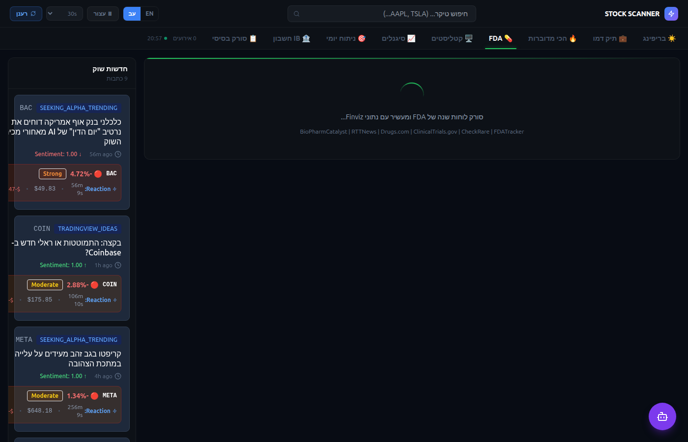
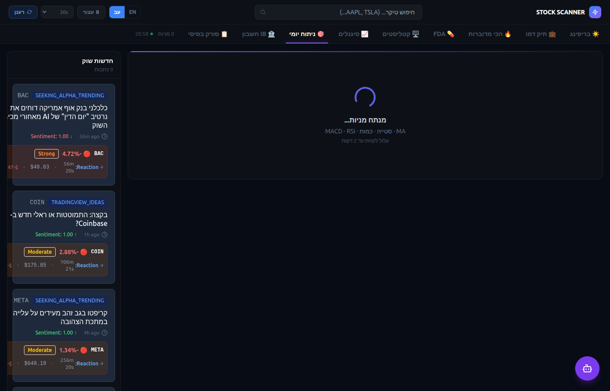
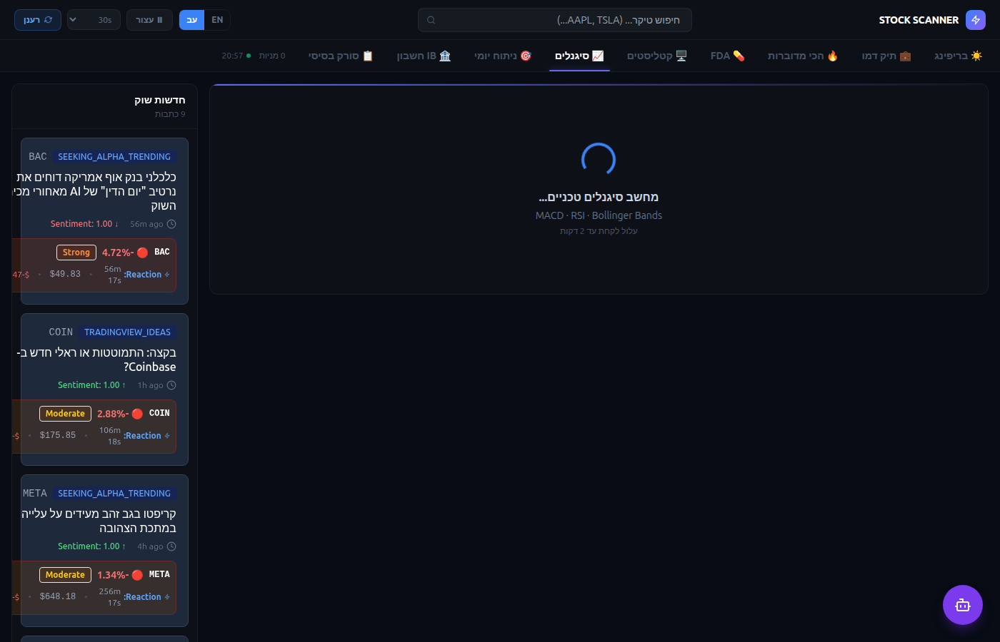
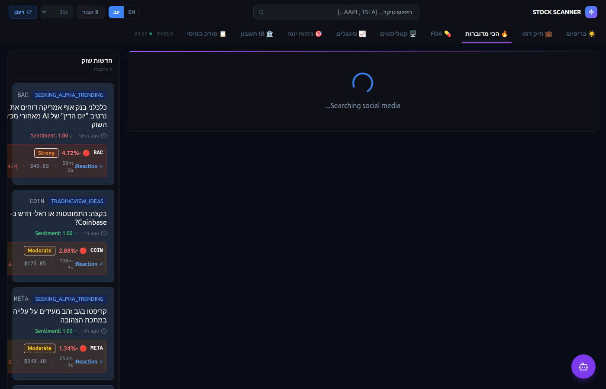
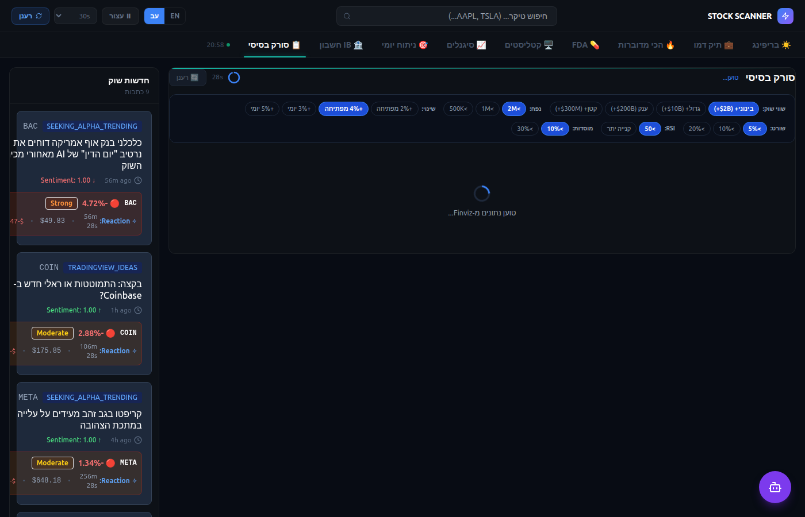

# Stock Scanner Dashboard

A real-time stock market intelligence platform built with **FastAPI** + **React**. Combines technical analysis, FDA catalyst tracking, social trending data, and AI-assisted briefings into a single Hebrew/English dashboard.

---

## Screenshots

### ☀️ Daily Briefing
Morning digest — top movers, sector heatmap, market status, live news feed.



---

### 💊 FDA Catalyst Tracker
Tracks upcoming PDUFA dates, NDA/BLA submissions, and Phase 3 trial results. Enriched with RSI, short interest, institutional ownership, and approval probability.



---

### 🎯 Daily Analysis — Composite Score
Scans 79+ stocks with MACD + RSI + MA deviation. Scores each stock 0–100 with entry/stop/target levels.



---

### 📈 Technical Signals
MACD crossover + RSI + Bollinger Bands scanner. Filters by sector and signal strength.



---

### 🔥 Trending Stocks
Social sentiment scanner — most discussed tickers across Reddit, StockTwits, and financial media.



---

### 📋 Basic Scanner (Finviz)
Finviz-powered fundamental screener with custom filters.



---

## Tech Stack

| Layer | Technology |
|-------|-----------|
| Backend | Python 3.11 · FastAPI · uvicorn |
| Frontend | React 18 · Vite · TailwindCSS · TanStack Query |
| Data | yfinance · Finviz · ClinicalTrials.gov · FDA sources |
| Broker | Interactive Brokers (IB Gateway) |
| Cache | In-memory (per-ticker 120s · full scan 90s · API 60s) |

---

## Tabs

| Tab | Description |
|-----|-------------|
| ☀️ בריפינג | Daily morning briefing — top 5 stocks by earnings beat + RSI |
| 💼 תיק דמו | Demo portfolio tracker |
| 🔥 הכי מדוברות | Social trending stocks |
| 💊 FDA | FDA catalyst calendar — PDUFA dates, NDA/BLA, Phase 3 |
| 🖥️ קטליסטים | Tech catalyst tracker (earnings events) |
| 📈 סיגנלים | Technical signals — MACD + RSI + Bollinger Bands |
| 🎯 ניתוח יומי | Daily composite analysis — score 0–100, entry/stop/target |
| 🏦 IB חשבון | Interactive Brokers live account / positions |
| 📋 סורק בסיסי | Finviz fundamental screener |

---

## Running Locally

### Backend
```bash
cd backend
source venv/bin/activate
python3 -m uvicorn app.main:app --host 0.0.0.0 --port 8000 --reload
```

### Frontend
```bash
# Requires Node via nvm
export NVM_DIR="$HOME/.nvm" && . "$NVM_DIR/nvm.sh"
cd frontend
npx vite --host 0.0.0.0
```

- Frontend: http://localhost:3000
- API docs: http://localhost:8000/docs

---

## API Endpoints

| Endpoint | Description |
|----------|-------------|
| `GET /api/briefing/daily` | Daily briefing (3h cache) |
| `GET /api/catalyst/fda` | FDA catalyst calendar |
| `GET /api/catalyst/tech` | Tech catalyst calendar |
| `GET /api/signals/technical` | Technical signals (MACD+RSI+BB) |
| `GET /api/analysis/daily` | Daily composite analysis |
| `GET /api/trending/social` | Social trending stocks |
| `GET /api/screener/vwap-momentum` | VWAP momentum screener |
| `GET /api/momentum/scanner` | Momentum scanner |

---

## FDA Data Sources

Data aggregated from 6 sources:
**BioPharmCatalyst** · **RTTNews** · **Drugs.com** · **ClinicalTrials.gov** · **CheckRare** · **FDATracker**

---

## Disclaimer

For educational and informational purposes only. Not financial advice.
